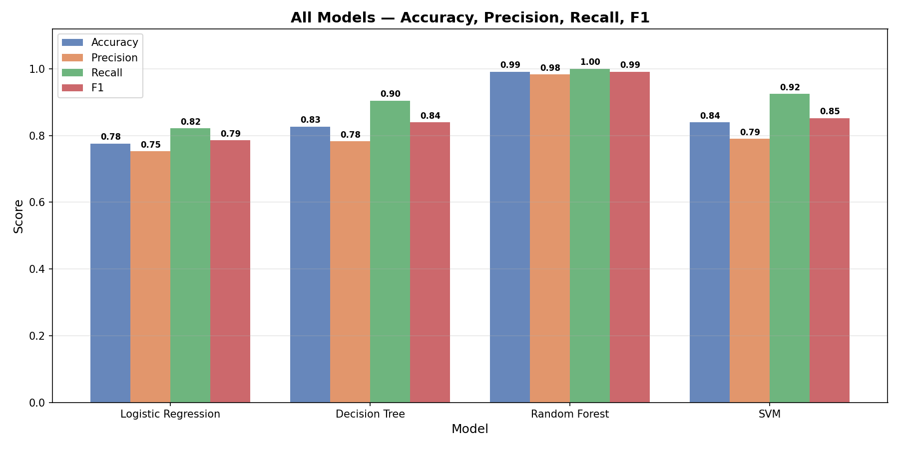
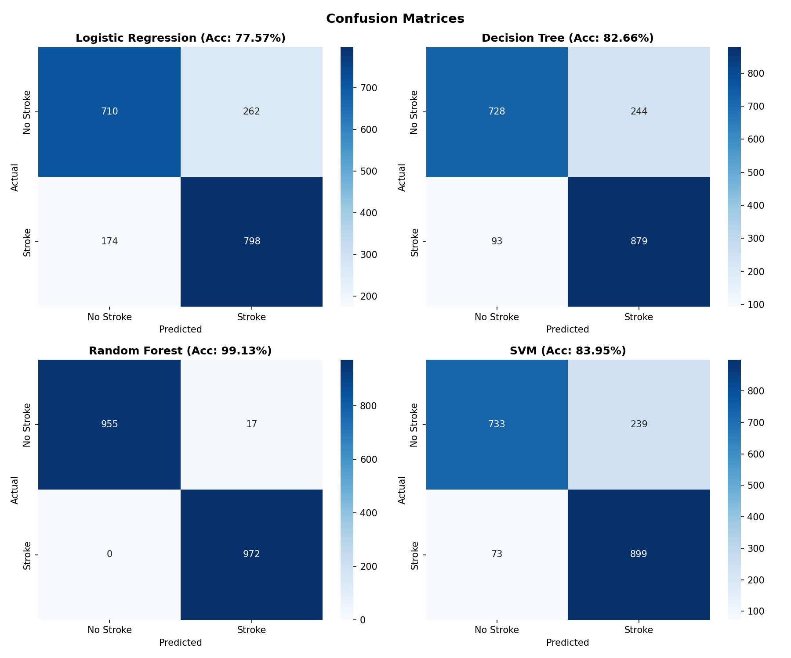
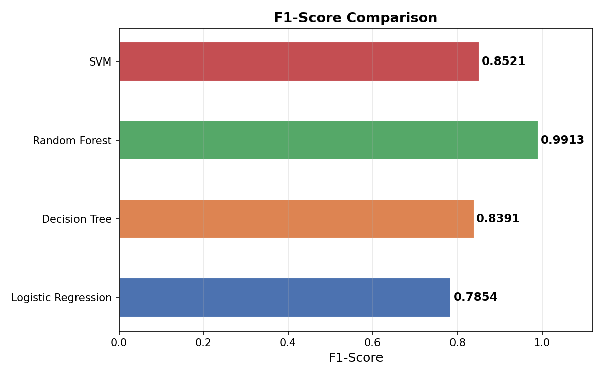

# Healthcare Stroke Prediction Using Machine Learning

<p align="center">


</p>

---

## Project Overview

This project implements a supervised machine learning pipeline to predict the likelihood of stroke using the **Healthcare Stroke Dataset**. The **project** includes **data preprocessing, class balancing, feature scaling, model training, evaluation, and visualization.**

_Four supervised learning algorithms are trained and compared to determine the best-performing model for stroke prediction._

---

## Key Features

- Data cleaning and preprocessing
- Missing value handling
- Label encoding for categorical features
- Random oversampling for class balancing
- Feature scaling using StandardScaler
- Training four supervised learning models
- Model evaluation using multiple performance metrics
- Confusion matrix visualization
- Performance comparison charts

---

## Dataset Information

| Property           | Value                     |
| ------------------ | ------------------------- |
| Dataset            | Healthcare Stroke Dataset |
| Total Records      | 5110                      |
| Total Features     | 12                        |
| Missing BMI Values | 201                       |
| Target Variable    | Stroke                    |

### Target Distribution

| Class     | Samples |
| --------- | ------- |
| No Stroke | 4861    |
| Stroke    | 249     |

**The original dataset is highly imbalanced. Random oversampling is applied before model training.**

---

## Data Preprocessing

The following preprocessing steps are performed:

- Removed the `id` column
- Removed the single record with `gender = Other`
- **Filled missing BMI values using the median**
- **Applied Label Encoding to categorical features**
- **Balanced the dataset using Random Oversampling**
- **Standardized numerical features using StandardScaler**

---

## Machine Learning Models

The following supervised learning algorithms are implemented:

| Model                        | Status    |
| ---------------------------- | --------- |
| Logistic Regression          | Completed |
| Decision Tree                | Completed |
| Random Forest                | Completed |
| Support Vector Machine (SVM) | Completed |

---

## Performance Comparison

| Model                  | Accuracy | Precision |  Recall | F1-Score |
| ---------------------- | -------: | --------: | ------: | -------: |
| Logistic Regression    |   77.57% |    75.28% |  82.10% |   78.54% |
| Decision Tree          |   82.66% |    78.27% |  90.43% |   83.91% |
| Random Forest          |   99.13% |    98.28% | 100.00% |   99.13% |
| Support Vector Machine |   83.95% |    79.00% |  92.49% |   85.21% |

---

## Best Performing Model

### Random Forest Classifier

| Metric    |   Value |
| --------- | ------: |
| Accuracy  |  99.13% |
| Precision |  98.28% |
| Recall    | 100.00% |
| F1-Score  |  99.13% |

### Summary

- Highest accuracy
- Highest precision
- Perfect recall
- Highest F1-score
- Best overall performance on the dataset

---

## Project Visualizations

### Model Comparison

**File:** `Model Comparison.png`



---

### Confusion Matrices

**File:** `Confusion Matrices.png`



---

### F1-Score Comparison

**File:** `F1-Score Comparison.png`



---

## Project Structure

```text
Healthcare_Stroke_Project/
│
├── stroke_prediction.py
├── Dataset/
│   ├── healthcare-dataset-stroke-data.csv
│
├── outputs/
│   ├── dataset_overview.txt
│   ├── preprocessing.txt
│   ├── class_balancing.txt
│   ├── train_test_split.txt
│   ├── model_results.txt
│   ├── comparison_table.txt
│   └── execution_summary.txt
│
├── screenshots/
│   ├── screenshots/comparison.png
│   ├── screenshots/confusion.png
│   └── screenshots/F1_comparison.png
│
└── README.md
```

---

## Install the required dependencies:

```bash
pip install pandas numpy matplotlib seaborn scikit-learn
```

---

## Usage

Run the project using:

```bash
python stroke_prediction.py
```

The program will:

1. Load the dataset.
2. Perform preprocessing.
3. Handle class imbalance.
4. Train four supervised learning models.
5. Evaluate model performance.
6. Generate comparison charts.
7. Save the visualization figures.

---

## Generated Outputs

### Output Files

- Dataset Overview
- Data Preprocessing
- Class Balancing
- Train-Test Split
- Model Results
- Comparison Table
- Execution Summary

### Figures

- Model Comparison Chart
- Confusion Matrices
- F1-Score Comparison Chart

---

## Technologies Used

- Python
- Pandas
- NumPy
- Scikit-Learn
- Matplotlib
- Seaborn

---

## Learning Outcomes

This project demonstrates:

- Data preprocessing techniques
- Handling missing values
- Class imbalance handling
- Feature scaling
- Supervised machine learning
- Model evaluation
- Performance comparison
- Data visualization

---

## License

This project is intended for academic and educational purposes.

---
